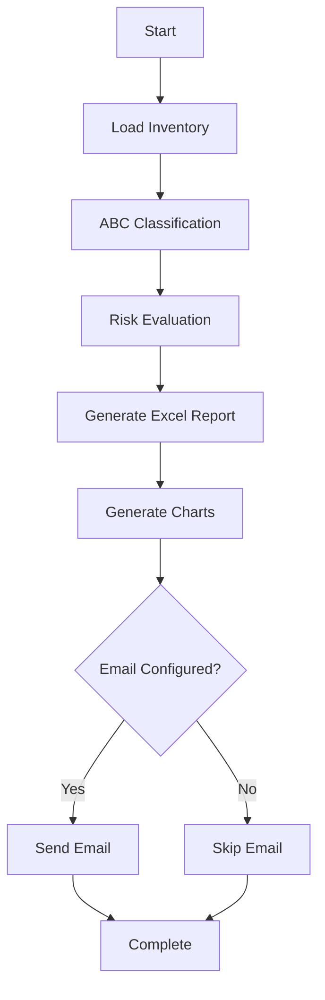

## Prerequisites

Before running the system, ensure you have:

- Python 3 installed
- All dependencies installed: `pip install -r requirements.txt`
- Input inventory file at `data/inventario.xlsx`
- (Optional) Email credentials configured in `.env` file

## Execution Command

From the project root directory, run:

```bash
python src/main.py
```

<Tip>
  Make sure you're in the project root directory (where `src/` folder is located) before running the command.
</Tip>

## Process Workflow

The system executes the following steps automatically (from `src/main.py:14-40`):

<Steps>
  <Step title="Load Inventory">
    Reads the inventory data from `data/inventario.xlsx`
    
    ```python
    df = cargar_inventario(RUTA_INVENTARIO)
    ```
    
    **Console Output:**
    ```
    ✅ Inventario cargado correctamente
    ```
  </Step>
  
  <Step title="ABC Classification">
    Applies ABC classification based on monthly sales
    
    ```python
    df = clasificacion_abc(df)
    ```
    
    **Console Output:**
    ```
    ✅ Clasificación ABC aplicada
    ```
  </Step>
  
  <Step title="Risk Evaluation">
    Evaluates stock levels and generates replenishment recommendations
    
    ```python
    df = evaluar_riesgo_y_reposicion(df)
    ```
    
    **Console Output:**
    ```
    ✅ Riesgo evaluado y reposición recomendada
    ```
  </Step>
  
  <Step title="Generate Excel Report">
    Creates multi-sheet Excel report with complete inventory, critical products, and at-risk products
    
    ```python
    generar_reporte_excel(df, RUTA_REPORTE)
    ```
    
    **Console Output:**
    ```
    ✅ Reporte Excel generado en output/reporte_inventario.xlsx
    ```
  </Step>
  
  <Step title="Generate Charts">
    Creates visualization charts for inventory status and ABC classification
    
    ```python
    generar_graficos(df, CARPETA_GRAFICOS)
    ```
    
    **Console Output:**
    ```
    ✅ Gráficos generados correctamente
    ```
  </Step>
  
  <Step title="Send Email (Optional)">
    Sends the report via email if credentials are configured
    
    ```python
    enviar_reporte(EMAIL_REMITENTE, EMAIL_PASSWORD, 
                   EMAIL_DESTINATARIO, RUTA_REPORTE)
    ```
    
    **Console Output (if configured):**
    ```
    ✅ Reporte enviado por correo
    ```
    
    **Console Output (if not configured):**
    ```
    ⚠️ Envío de correo omitido (credenciales no configuradas)
    ```
  </Step>
</Steps>

## Complete Console Output Example

A successful execution displays:

```bash
✅ Inventario cargado correctamente
✅ Clasificación ABC aplicada
✅ Riesgo evaluado y reposición recomendada
✅ Reporte Excel generado en output/reporte_inventario.xlsx
✅ Gráficos generados correctamente
✅ Reporte enviado por correo
```

<Note>
  The checkmark (✅) emoji indicates successful completion of each step. The warning (⚠️) emoji indicates a non-critical issue (like email being skipped).
</Note>

## Understanding Console Messages

### Success Indicators

| Message | Meaning | Source |
|---------|---------|--------|
| `✅ Inventario cargado correctamente` | Inventory file loaded successfully | `src/loader.py:10` |
| `✅ Clasificación ABC aplicada` | ABC classification completed | `src/analisis.py:30` |
| `✅ Riesgo evaluado y reposición recomendada` | Risk analysis and recommendations generated | `src/decisiones.py:29` |
| `✅ Reporte Excel generado en [path]` | Excel report created at specified path | `src/reportes.py:31` |
| `✅ Gráficos generados correctamente` | Charts created successfully | `src/reportes_graficos.py:32` |
| `✅ Reporte enviado por correo` | Email sent successfully | `src/emailer.py:34` |

### Warning Indicators

| Message | Meaning | Action Required |
|---------|---------|------------------|
| `⚠️ Envío de correo omitido (credenciales no configuradas)` | Email credentials missing or invalid | Configure `.env` file with email credentials |

### Error Indicators

| Message | Meaning | Action Required |
|---------|---------|------------------|
| `❌ Error al cargar inventario: [error]` | Failed to load input file | Check that `data/inventario.xlsx` exists and is readable |

## Exit Codes

The system uses standard exit codes:

- **0**: Success - All operations completed successfully
- **Non-zero**: Error - An exception occurred during execution

<Tip>
  You can check the exit code in bash using `echo $?` immediately after running the script.
</Tip>

## Execution Time

Typical execution times vary based on inventory size:

- **Small inventory (< 100 products):** 1-2 seconds
- **Medium inventory (100-1000 products):** 2-5 seconds
- **Large inventory (> 1000 products):** 5-10 seconds

<Note>
  Email sending may add 2-5 additional seconds depending on network speed and attachment size.
</Note>

## Process Flow Diagram



## Troubleshooting Common Issues

<AccordionGroup>
  <Accordion title="FileNotFoundError: data/inventario.xlsx">
    **Cause:** Input file doesn't exist at the expected location.
    
    **Solution:** 
    - Ensure `data/inventario.xlsx` exists in the project
    - Check the file path is correct
    - Verify you're running from the project root directory
  </Accordion>
  
  <Accordion title="PermissionError: output/reporte_inventario.xlsx">
    **Cause:** Output file is open in Excel or permissions issue.
    
    **Solution:** 
    - Close the Excel file if it's open
    - Check write permissions on the `output/` directory
    - Try running with appropriate permissions
  </Accordion>
  
  <Accordion title="ModuleNotFoundError: No module named 'pandas'">
    **Cause:** Required dependencies not installed.
    
    **Solution:** 
    ```bash
    pip install -r requirements.txt
    ```
  </Accordion>
  
  <Accordion title="Email not sending (no error message)">
    **Cause:** Email credentials not properly configured.
    
    **Solution:** 
    - Verify `.env` file exists and contains valid credentials
    - Check that variables don't contain placeholder values
    - See the [Email Setup Guide](/guide/email-setup) for detailed configuration
  </Accordion>
</AccordionGroup>

## Automated Execution

You can automate the system execution using:

### Cron (Linux/Mac)

Edit crontab:
```bash
crontab -e
```

Add a daily execution at 8 AM:
```bash
0 8 * * * cd /path/to/project && python src/main.py >> logs/execution.log 2>&1
```

### Task Scheduler (Windows)

Create a scheduled task to run:
```batch
cd C:\path\to\project
python src\main.py
```

<Warning>
  When scheduling automated execution, ensure the system has access to the `.env` file and that file paths are absolute or relative to the project root.
</Warning>

## Next Steps

<CardGroup cols={2}>
  <Card title="Understanding Outputs" icon="chart-bar" href="/guide/understanding-outputs">
    Learn how to interpret the generated reports and charts
  </Card>
  <Card title="Email Setup" icon="envelope" href="/guide/email-setup">
    Configure email delivery for automated reporting
  </Card>
</CardGroup>